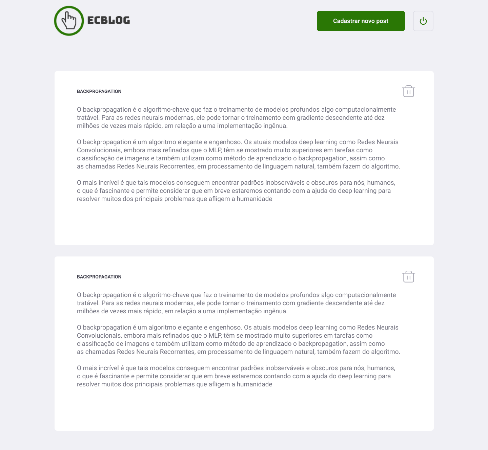

<!-- então bora codar! -->

<h1 align="center">
    
</h1>

<h2 align="center"> Blog - Desenvolvido durante o processo de treinee na Pampec Jr </h2>

<h3 align="center"> Criada com html, css, sass e nodejs </h3>

<p align="center"> Usando o poder de uma stack poderosa, que utiliza de uma única linguagem popular e moderna, o  JavaScript. <br> Produtividade e performance de forma enxuta. </p>

---

O Processo de treinee da Pampec Jr, trouxe como projeto um desenvolvimento de um blog.Em um periodo foi desenvolvida uma aplicação do zero, dominando o design, backend, frontend.

[Layout](https://www.figma.com/file/F7J0xOo7et8KzWBLFZFL89/ec---blog-treinee%2Fpampec) da aplicação no  Figma.

## Para rodar a aplicação

> OBS: pode-se utilizar o gerenciador de pacotes npm ou o yarn para rodar os comandos abaixo

Execute ```npm install``` para instalar as dependências.

Rode ```npm start``` nas pastas backend e frontend para utilizar a versão web. Acesse via **localhost:3333**.


## Telas

<p align="center">
    
    
    
</p>
---

<h4 align="center"> <em>&lt;/&gt;</em> by <a href="https://github.com/Rodrigo-Segui" target="_blank">rodrigo_segui</a> </h4>
